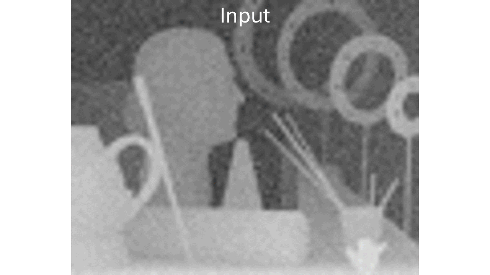

# GPU-Accelerated Iterative Bilateral Solver

This repository provides a standalone implementation of the **GPU-accelerated bilateral solver**
introduced in our [paper]() (*Modular Neural Image Signal Processing*, Afifi et al., 2025 — supplemental Sec. A).

Our solver is built on the original 
[Fast Bilateral Solver (FBS)](https://arxiv.org/pdf/1511.03296), 
but is redesigned entirely using dense GPU-friendly tensor operations, 
achieving **up to 15x (~7x on average) faster performance on GPU**<sup>*</sup> 
compared to the CPU-based FBS.


<p align="center">
  
</p>


<p align="center">
  
</p>


<small><sup>*</sup> Measured on an Intel Core i7-14700K CPU and an NVIDIA GeForce RTX 4080 SUPER (16 GB VRAM); speedups range from 1.8× to 15× depending on the number of iterations.</small>


---

## 🛠️ Requirements

- Python 3.8+
- PyTorch (GPU build recommended)
- OpenCV
- NumPy
---

## ▶️ Running the Demo
```bash
python demo.py \
    --input-image-path path/to/input.png \
    --reference-image-path path/to/guidance.png
```
The solver will refine the input using the guidance image, save the output as: `input_output.png`

---

## 📄 Citation
If you use this solver in your research, please cite:
```
@article{afifi2025modular,
  title={Modular Neural Image Signal Processing},
  author={Afifi, Mahmoud and Wang, Zhongling and Zhang, Ran and Brown, Michael S.},
  year={2025}
}
```
